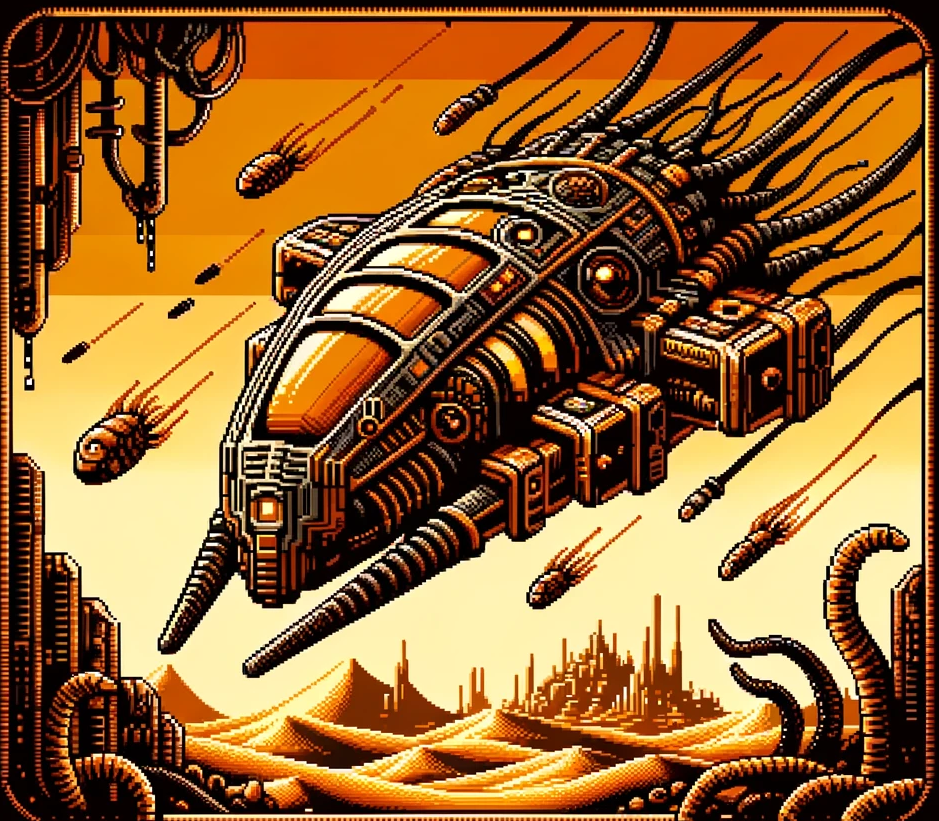
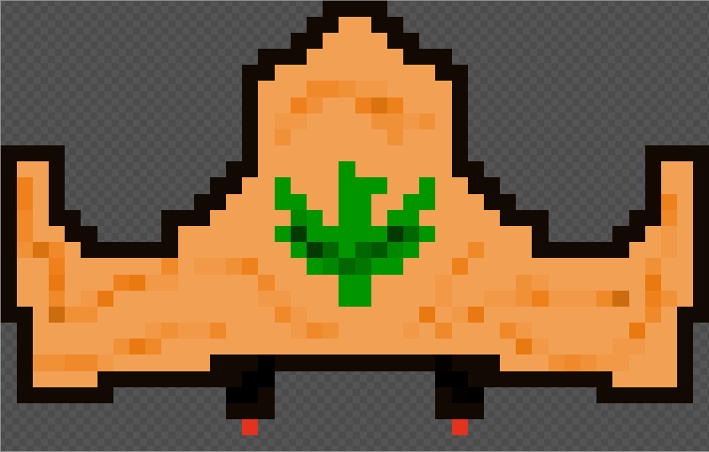

# Dune Invaders 🏜️




 
Welcome to Arrakis! This is a retro-style game inspired by the classic Space Invaders game, set in the universe of Frank Herbert's "Dune". In this game, you'll find yourself defending the desert planet of Arrakis against waves of invading enemy ships. 

This is a personal project aimed at learning Object-Oriented Programming (OOP) concepts and game development.


## Game Background:
After a successful revolt against the oppressive rule of House Harkonnen and the Padishah Emperor Shaddam IV, Paul Muad'Dib Atreides ascends as the Duke of Arrakis. 

While many Fremen embark on the Holy War, a select few remain behind to protect their land. As a defender of Arrakis, your mission is to safeguard the precious spice production from a wave of Harkonens invaders. Use your environment in your favor to defend from enemy lasers and stop them from reaching the planet's most precious resource.

## Controls 🎮
### **Goal**: Destroy all Harkonens spaceships 
- Use the left and right arrow keys to move the spaceship horizontally.
- Press the spacebar to shoot lasers at Harkonnen's ships.

<br>

# Screenshots and Sprites


### The Fremen's Spaceship uses the Atreides House logo as a symbol of fidelity to Paul

<br>





# Installation: 
1. Clone this repo: ```git clone https://github.com/your-username/space-invaders-dune.git ``` 
2. Compile the game using the Makefile ```make ```
3. Run the Game ```./main ``` 

### Disclaimer: 
Space Invaders: Dune Edition is a non-commercial project created for educational purposes only. It is not affiliated with or endorsed by the creators of "Dune" or any associated entities.
